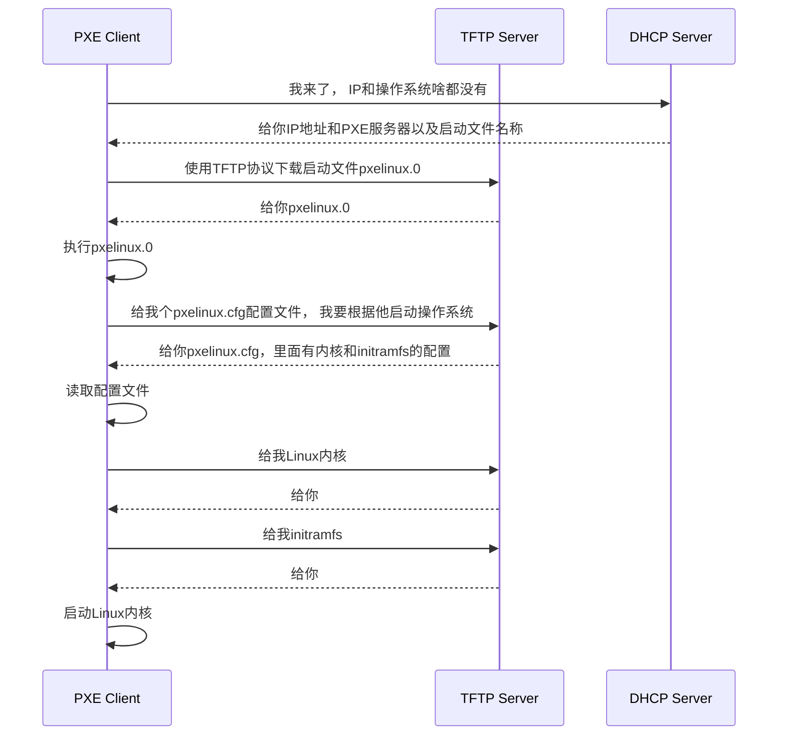

预启动执行环境 （Pre-boot Exceution Environment）

> 背景： 数据中心新来的机器没有OS， 没有IP， 都不能用咋办， 希望能自动安装OS， 自动分配IP

Q: 数据中心新来的一批机器， 没有OS， 如何安装OS？
A: 问题类似[[操作系统的启动]]。 
1. 首先启动BIOS （特别小的OS， 只能干一件事， 读取硬盘的MBR启动扇区，将GRUB启动起来， 将权利交给GRUB）
2. GRUB加载内核、加载作为根文件系统的initramfs文件，然后将权利交给内核
3. 内核启动，初始化整个OS
所以我们安装OS只能放到BIOS启动之后了，因为没安装OS之前，启动扇区都没有。所以这个过程叫做预启动执行环境PXE

dhcp server是可以配置的， 通过`next-server`配置PXE服务器地址，下载`filename`指定的启动文件

