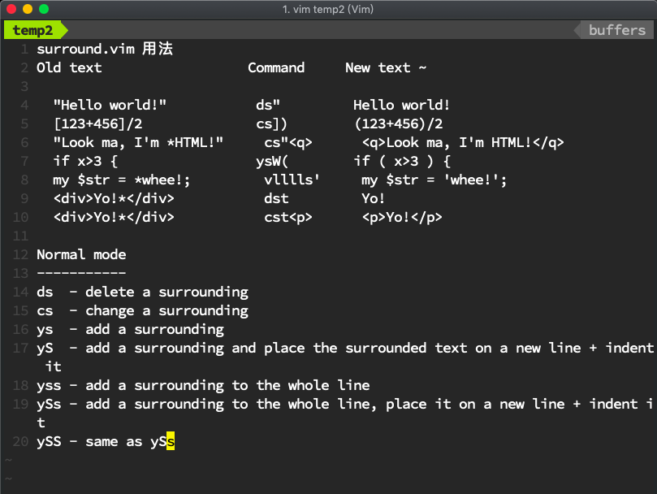

用例子来解释是最容易的。按cs"'里面
"Hello world!"
改为
'Hello world!'
现在按cs'<q>将其更改为
<q>Hello world!</q>
要走完整圈，按下cst"即可
"Hello world!"
要完全删除分隔符，请按ds"。
Hello world!
现在将光标放在“Hello”上，按ysiw]（iw是文本对象）。
[Hello] world!
让我们做括号并添加一些空间（使用}而不是{没有空格）：cs]{
{ Hello } world!
现在用yssb或将整行用括号括起来yss)。
({ Hello } world!)
恢复原文： ds{ds)
Hello world!
问候你好： ysiw<em>
<em>Hello</em> world!
最后，让我们尝试一下视觉模式。按下大写V（对于线性可视模式），然后按S
。

<em>Hello</em> world!

这个插件非常适用于HTML和XML编辑，这个目前似乎在Vim土地上没有充足。（与HTML / XML 插入相反 ，其中有许多插件可用）。同时添加，更改和删除标签对是一件轻而易举的事。
该.命令将工作ds，cs以及yss如果你安装 repeat.vim。
