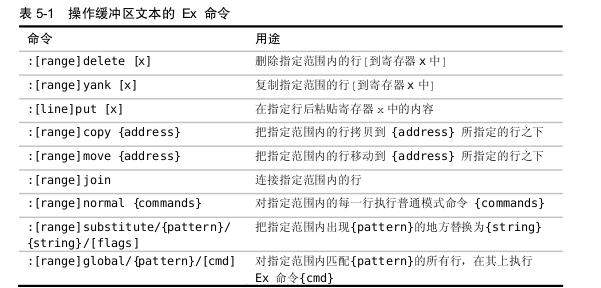
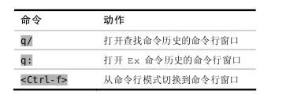

## 通过冒号:
进入命令行模式

#### 典例：
- :3p
- :3d
- :2,$p
- : . , .+3p
- :0,$-1t0 
- :2,5m0
- :%normal A;
- :%normal i233

- :/<html>/+1, /\/html>/-1d (从光标位置开始往后找（到了末尾没找到再从头找），匹配到的第一对作为分割线

### 回溯历史命令

命令行模式中：Ctrl-p 与 Ctrl-n
