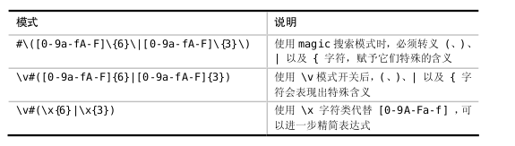
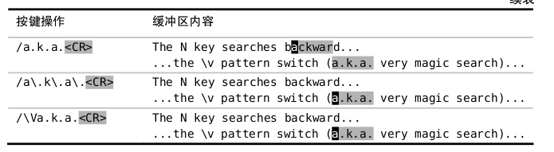
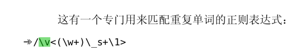
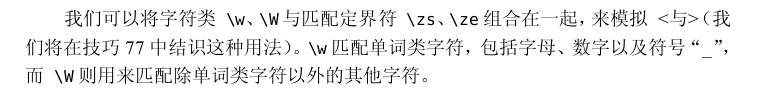
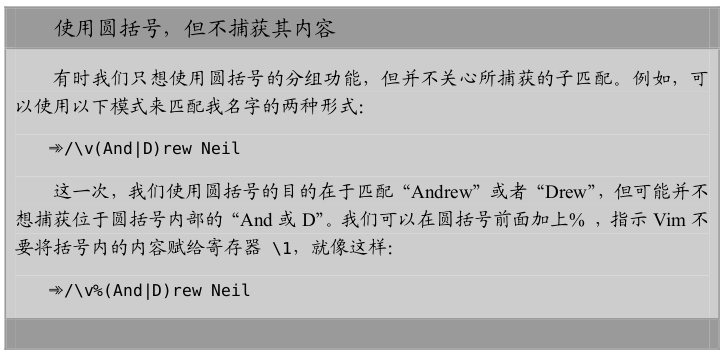
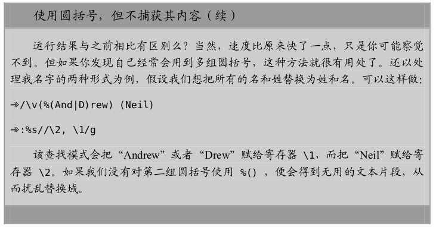
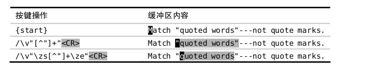
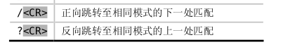

- 正则匹配用\v

- 匹配原文用\V

- 界定匹配边界

- 转义字符
    + 正向查找需要转义 /
    + 反向查找需要转义 ?
    + 任何时候都需要转义 \

# 查找
- 不输入内容则默认使用上一次查找的内容
    +    
    +    %s///gn 替换时同样如此。使用上一次查找的内容。
- 根据预览结果对查找域进行自动补全。 <C-r><C-w>

- /\v'(([^']|'\w)+)'匹配引号包含的内容
- :%s//“\1”/gg 把单引号换成双引号

