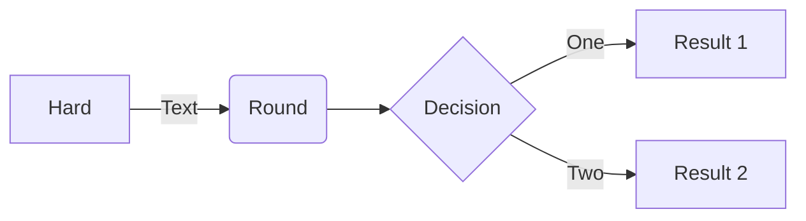
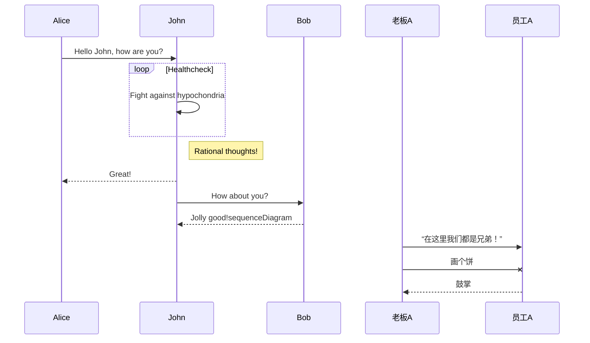
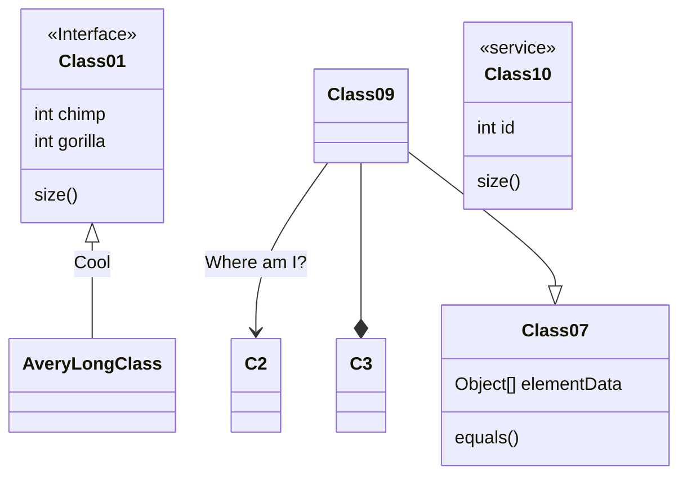

Mermaid对比plantuml - Google 搜索

https://www.zhihu.com/question/52157612/answer/1739194372
https://gowa.club/Graphviz/%E5%87%A0%E7%A7%8D%E7%BB%98%E5%9B%BE%E8%AF%AD%E6%B3%95%E7%9A%84%E6%AF%94%E8%BE%83.html
https://www.hikerpig.cn/2021-11-24-laziness-as-a-virtue-no-more-handdraw-sequence-diagram/
https://zhuanlan.zhihu.com/p/138847719
https://zhuanlan.zhihu.com/p/355997933


诉求：Markdown中绘制流程图/时序图/类图
其他类型的图都不重要

Diagram as Text
可以省去手绘 UML 图表时调整布局等的时间。 通过文本 DSL 生成图表。文本本身也具有一些可读性，以及（划重点！）对 git diff 友好。在不断演变的技术文档内使用还是比较合理的。

适合什么情况
画常用的几种 UML 图表（时序图、类图、流程图、部署图等）。
处于方案的早期设计和交流阶段，快速修改。

不适合什么情况
这样的情况建议还是手绘

难以归入标准 UML 的示意图
复杂的架构图


1. codehub/wiki/3ms
2. typora / vscode / mdstorm
3. 主题配置
4. 语法简单
5. 支持的图的类型
6. markdown支持
7. star个数
8. graphviz 1
9. 使用成本（安装部署）


##  Mermaid

[在线编辑器](https://mermaid-js.github.io/mermaid/#/)
文档： https://mermaid-js.github.io/mermaid/#/   and https://github.com/mermaid-js/mermaid/blob/develop/README.zh-CN.md

Mermaid 是一个基于 Javascript 的图表绘制工具，通过解析类 Markdown 的文本语法来实现图表的创建和动态修改。Mermaid 诞生的主要目的是让文档的更新能够及时跟上开发进度。

vscode中安装扩展: `Markdown Preview Mermaid` 即可显示如下时序图








## PlantUML 

Github：  
文档：
编辑器： https://plantuml-editor.kkeisuke.com/#
主题： https://bschwarz.github.io/puml-themes/themes/cyborg/

语法简单明了，但需要装java，用plantuml.jar包。设几个环境变量，可移植性不高，支持png, svg图片导出。

```mermai
@startuml
!theme spacelab
class Example {
  Theme spacelab
}
@enduml
```

## yUML
其渲染图片引擎不需要调额外的web服务
以下几种常用的uml图都支持用代码的形式表式
Class
Activity
Use-case
State
Deployment
Package
[new] Sequence
最新的语法支持Markdown了！！！


## pintora

官网： https://pintorajs.vercel.app/zh-CN/docs/intro/
Github： https://github.com/hikerpig/pintora  star552