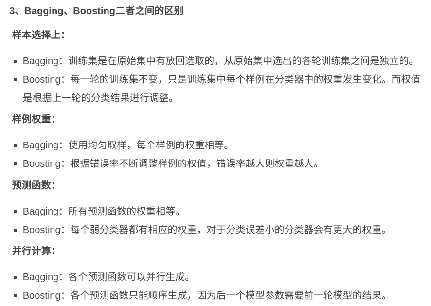
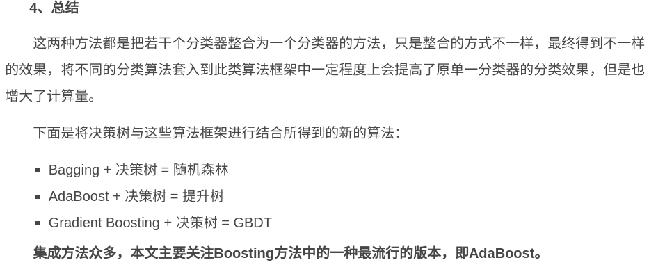
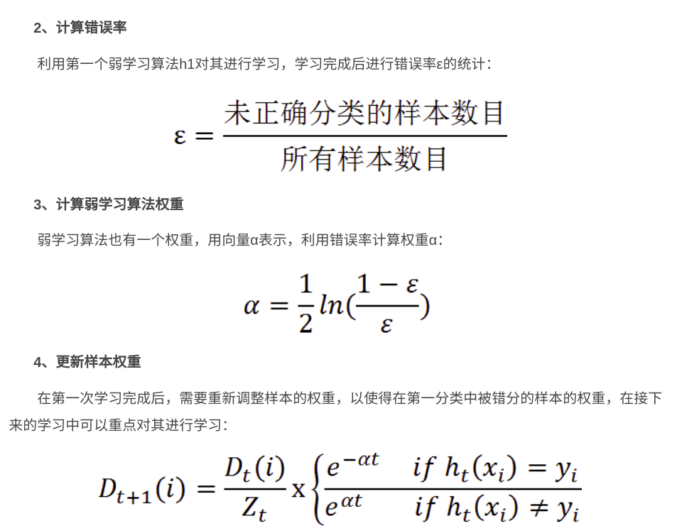

[adaboost](https://cuijiahua.com/blog/2017/11/ml_10_adaboost.html)

1、Bagging
自举汇聚法（bootstrap aggregating），也称为bagging方法。Bagging对训练数据采用自举采样（boostrap sampling），即有放回地采样数据，主要思想：
从原始样本集中抽取训练集。每轮从原始样本集中使用Bootstraping的方法抽取n个训练样本（在训练集中，有些样本可能被多次抽取到，而有些样本可能一次都没有被抽中）。共进行k轮抽取，得到k个训练集。（k个训练集之间是相互独立的）
每次使用一个训练集得到一个模型，k个训练集共得到k个模型。（注：这里并没有具体的分类算法或回归方法，我们可以根据具体问题采用不同的分类或回归方法，如决策树、感知器等）
对分类问题：将上步得到的k个模型采用投票的方式得到分类结果；对回归问题，计算上述模型的均值作为最后的结果。（所有模型的重要性相同）

2、Boosting
Boosting是一种与Bagging很类似的技术。Boosting的思路则是采用重赋权（re-weighting）法迭代地训练基分类器，主要思想：
每一轮的训练数据样本赋予一个权重，并且每一轮样本的权值分布依赖上一轮的分类结果。
基分类器之间采用序列式的线性加权方式进行组合。

3. Adaboost

