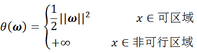
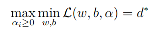
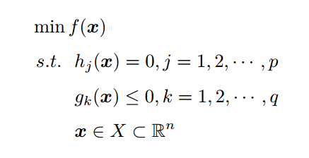

## 支持向量机
### 分类间隔
这个d就是"分类间隔"。其中||w||表示w的***二范数***，求所有元素的平方和，然后再开方。比如对于二维平面：

那么，

最终的目标函数和约束条件放在一起进行描述：

**如果集合中任意2个元素连线上的点也在集合中，那么这个集合就是凸集。**
对于我们的目标函数：

很显然，它是一个凸函数。所以，可以使用我接下来讲述的方法求取最优解。
#### 最优化问题的分类
对于第(a)类无约束条件的优化问题，尝试使用的方法就是费马大定理(Fermat)，即使用求取函数f(x)的导数，然后令其为零，可以求得候选最优值，再在这些候选值中验证；如果是凸函数，可以保证是最优解。这也就是我们高中经常使用的求函数的极值的方法。
对于第(b)类有等式约束条件的优化问题，常常使用的方法就是拉格朗日乘子法（Lagrange Multiplier) ，即把等式约束h_i(x)用一个系数与f(x)写为一个式子，称为拉格朗日函数，而系数称为拉格朗日乘子。通过拉格朗日函数对各个变量求导，令其为零，可以求得候选值集合，然后验证求得最优值。
对于第(c)类有不等式约束的优化问题，常常使用的方法就是**KKT条件**。同样地，我们把所有的等式、不等式约束与f(x)写为一个式子，也叫拉格朗日函数，系数也称拉格朗日乘子，通过一些条件，可以求出最优值的**必要条件**，这个条件称为KKT条件。
#### 拉格朗日函数
所以，显而易见的是，我们在拉格朗日优化我们的问题这个道路上，**需要进行下面二个步骤：**
将有约束的原始目标函数转换为无约束的新构造的拉格朗日目标函数 (他们是是等价的问题。这就是使用拉格朗日方程的目的)
使用拉格朗日对偶性，将不易求解的优化问题转化为易求解的优化 (因为使用拉格朗日获得的函数，使用求导的方法求解依然困难)
##### 第一步：将有约束的原始目标函数转换为无约束的新构造的拉格朗日目标函数
公式变形如下：

其中αi是拉格朗日乘子，αi大于等于0，是我们构造新目标函数时引入的系数变量(我们自己设置)。
现在，我们的问题变成了求新目标函数的最小值，即：

##### 第二步：**将不易求解的优化问题转化为易求解的优化**
对偶问题

这个新问题的最优值用d*来表示。而且d\*<=p*。
当满足以下条件时, d=p
首先必须满足这个优化问题是凸优化问题(**求取最小值的目标函数为凸函数的一类优化问题**)。
其次，需要满足KKT条件
##### KKT条件
通过KKT条件，可以求出最优值的必要条件

KKT条件的全称是Karush-Kuhn-Tucker条件，KKT条件是说最优值条件必须满足以下条件：
条件一：经过拉格朗日函数处理之后的新目标函数L(w,b,α)对x求导为零：
条件二：h(x) = 0；
条件三：α*g(x) = 0；
**对偶问题求解**
**第一步：**
根据上述推导已知：

首先固定α，要让L(w,b,α)关于w和b最小化，我们分别对w和b偏导数，令其等于0，即：

将上述结果带回L(w,b,α)得到只含有一个变量，即αi的公式
**第二步：**
现在内侧的最小值求解完成，我们求解外侧的最大值，从上面的式子得到

## SMO算法
几乎所有数据都不那么"干净"。这时我们就可以通过引入所谓的***松弛变量ξ(slack variable)和惩罚参数C***，来允许有些数据点可以处于超平面的错误的一侧。此时我们的约束条件有所改变：

同时，考虑到松弛变量和松弛变量ξ和惩罚参数C，目标函数变为：

原始问题的拉格朗日函数变为：

对偶问题拉格朗日函数的极大极小问题，得到以下等价优化问题：

