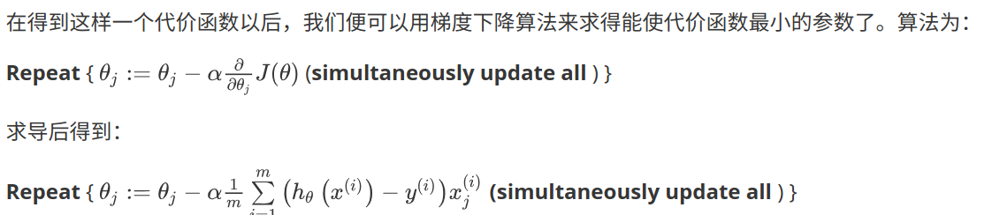

辑回归算法实际上是一种分类算法，它适用于标签  取值离散的情况，如：1 0 0 1。
逻辑回归输出在0-1之间，而线性回归不是。
sigmod function <=> logistic function


决策边界(decision boundary)会使各个实例输出大于或小于零的某个值，然后带入sigmod函数即可得到分类的概率。


通过最小化代价函数选择thera
对于线性回归模型，我们定义的代价函数是**所有模型误差的平方和**。理论上来说，我们也可以对逻辑回归模型沿用这个定义，但是问题在于，当我们将sigmod function带入到这样定义了的代价函数中时，我们得到的代价函数将是一个非凸函数（non-convexfunction）。
所以我们重新定义逻辑回归的代价函数。

>python代码实现
```python
import numpy as np
    
def cost(theta, X, y):
    
  theta = np.matrix(theta)
  X = np.matrix(X)
  y = np.matrix(y)
  first = np.multiply(-y, np.log(sigmoid(X* theta.T)))
  second = np.multiply((1 - y), np.log(1 - sigmoid(X* theta.T)))
  return np.sum(first - second) / (len(X))

```


------------------
>特征缩放同样适用于逻辑回归，使梯度下降法更快收敛。


除了梯度下降算法以外，还有一些常被用来令代价函数最小的算法。

这些算法有：
- 共轭梯度（Conjugate Gradient）
- 局部优化法(Broyden fletcher goldfarb shann,BFGS)
- 有限内存局部优化法(LBFGS) 
优缺点：
- 更加复杂和优越，
- 通常不需要人工选择学习率，
    - 事实上，他们确实有一个智能的内部循环，称为线性搜索(line search)算法，它可以自动尝试不同的学习速率 ，并自动选择一个好的学习速率 ，因此它甚至可以为每次迭代选择不同的学习速率，那么你就不需要自己选择。
- 通常比梯度下降算法要更加快速。

## 多分类， 一对多
每次把一个作为正类，其他均为负类。

奇异矩阵不可逆。
但正规方程法，加上正则化参数后是一定可逆的。
